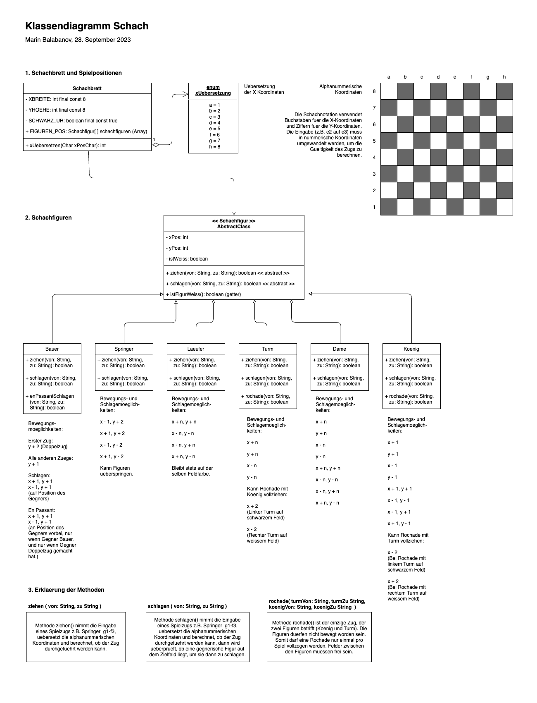

# ChessUML
 
Erster Entwurf eines UML-Klassendiagrams fuer Schachspiele. Hier wird das Schachbrett beschrieben, die abstrakte Klasse fuer Spielfiguren, und die Konkretisierungen fuer jede Figurenart. Methoden fuer das Ziehen und Schlagen werden skizziert sowie fuer die Rochade und das En-Passant-Schlagen.

Dieses Diagramm wurde mit diagrams.net (vormals draw.io) erstellt, und wird sich weiterentwickeln.

